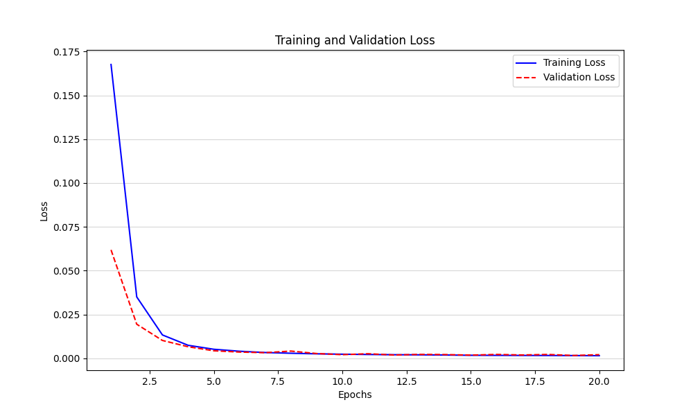

# unet-training
A python implementation to train a U-Net model for MRI phantom segmentation using pytorch

## Table of Contents
- [Introduction](#introduction)
- [Repository Structure](#repository-structure)
- [Dependencies](#dependencies)
- [Usage](#usage)
- [Notes](#notes)

## Introduction

The project focuses on training a UNet model to accurately segment MRI phantoms from noisy images. It utilizes synthetically generated data consisting of DICOM images, corresponding masks, and noise-augmented versions of the original images.

## Repository Structure

* **`data_generation.py`:** Generates synthetic MRI data, including masks and noise-augmented images. 
* **`data.py`:** Defines PyTorch datasets for loading and preprocessing the MRI data.
* **`model.py`:** Defines the UNet model architecture.
* **`train.py`:** Trains the UNet model, saves the best model parameters, and evaluates the model on test data.
* **`utils.py`:** Provides utility functions, including IoU score calculation and early stopping mechanism.

## Dependencies

* Python 3.x
* PyTorch
* SimpleITK
* OpenCV (`cv2`)
* NumPy
* Pandas
* Matplotlib
* scikit-learn

## Usage

1. **Data Generation:**
   - Place your original MRI DICOM files in a folder named `mri_data`.
   - Run `data_generation.py` to generate synthetic data, including masks and noisy images. 
   - The generated data will be saved in the `Dataset` folder.

2. **Training:**
   - Set the desired hyperparameters in `train.py`.
   - Run `train.py` to train the UNet model.
   - The best model parameters and training progress will be saved in the `models` and `plots` folders respectively.

3. **Testing:**
   - After training, the `train.py` script will evaluate the best model on the test data and generate segmentation plots.

## Notes

* The `train.py` script allows for training with either individual image files or NumPy arrays. 
* The data loading and preprocessing methods are defined in `data.py`.
* Early stopping is implemented in `utils.py` to prevent overfitting.
